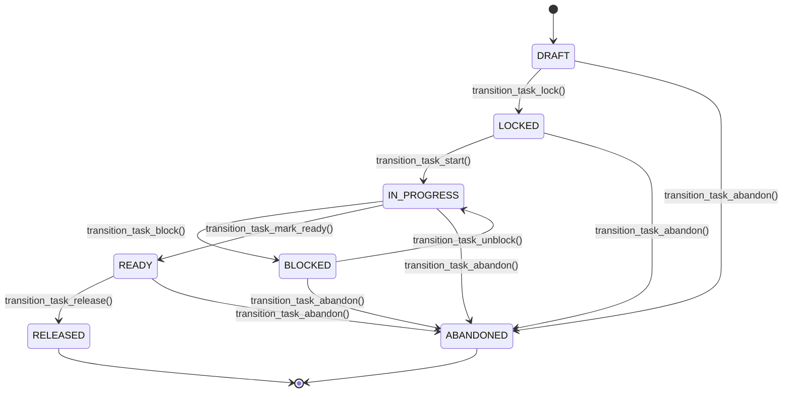
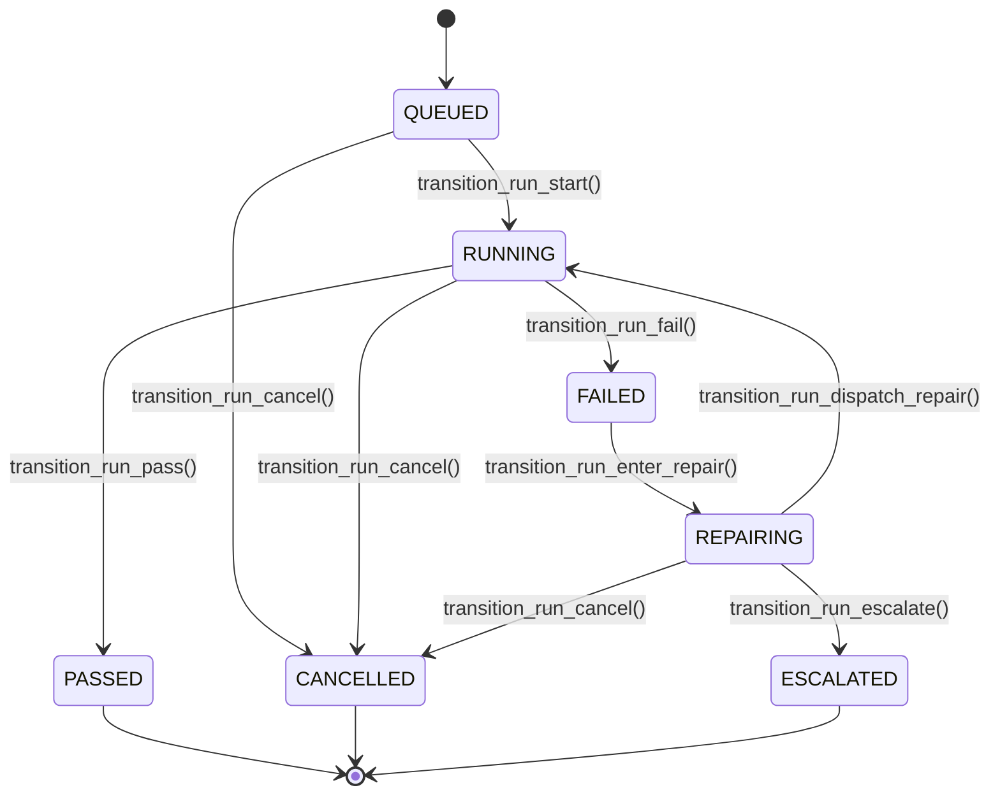

# AOS State Machines: Domain Specifications & Invariants

This document specifies the formal state machines governing the lifecycle of engineering tasks and execution runs within AOS.

---

## 1. Design & Immutability Principles

1. **Immutability by Default:** All domain entities (`Task`, `Run`) are immutable Pydantic v2 models (`frozen = True`, `extra = "forbid"`). Direct attribute modification outside the transition layer (e.g. `run.status = RunStatus.PASSED`) is strictly prohibited and rejected by schema validation.
2. **Pure Functional Transitions:** State transitions are implemented as pure functions in `aos.contracts.transitions`. Every transition returns a `TransitionResult[EntityT, EventPayloadT]` containing:
   - A newly constructed, updated entity instance (`entity`).
   - A corresponding typed event payload representation (`event_payload`).
3. **Deterministic Error Handling:** Any transition not explicitly permitted in the transition matrix raises `InvalidStateTransitionError`. Silent no-ops are prohibited.

---

## 2. Task Lifecycle (`TaskStatus`)

A `Task` captures an engineering objective, its versioned requirements, acceptance criteria, and policy assignment.

### Task State Matrix

| Source State | Target State | Transition Function | Preconditions & Invariants |
|---|---|---|---|
| `DRAFT` | `LOCKED` | `transition_task_lock` | Requires `requirement_version >= 1` and non-empty `acceptance_criteria`. |
| `LOCKED` | `IN_PROGRESS` | `transition_task_start` | Execution begins; worker picks up task. |
| `IN_PROGRESS` | `BLOCKED` | `transition_task_block` | Requires explicit non-empty `reason`. |
| `BLOCKED` | `IN_PROGRESS` | `transition_task_unblock` | Resumes active engineering execution. |
| `IN_PROGRESS` | `READY` | `transition_task_mark_ready` | All required verification checks have passed. |
| `READY` | `RELEASED` | `transition_task_release` | Requires non-empty `approval_id: str`. (See approval boundary below). |
| Non-Terminal | `ABANDONED` | `transition_task_abandon` | Reachable from `DRAFT`, `LOCKED`, `IN_PROGRESS`, `BLOCKED`, `READY`. Requires `reason`. |

### Task Release & Approval Boundary Invariant
- `READY → RELEASED` (`transition_task_release`): Requires a non-empty `approval_id: str` string.
- **Contract Carriage Only:** Phase 0 strictly records this reference (`release_approval_id`) as part of the domain contract.
- **Enforcement Boundary:** Phase 0 does **NOT** query for an `Approval` object, check cryptographic signatures, verify expiration, evaluate authorization, or perform human-decision validation. All enforcement checks remain strictly deferred to **Phase 12 (Release Gates)**.

---

## 3. Run Lifecycle (`RunStatus`) & Self-Repair Semantics

A `Run` models a single execution instance attempting to fulfill a `Task`'s acceptance criteria.

### Run State Matrix

| Source State | Target State | Transition Function | Preconditions & Accounting Invariants |
|---|---|---|---|
| `QUEUED` | `RUNNING` | `transition_run_start` | Assigns optional `worker_id`. Execution begins. |
| `RUNNING` | `PASSED` | `transition_run_pass` | All verification checks pass. Terminal state. |
| `RUNNING` | `FAILED` | `transition_run_fail` | One or more verification checks failed. Requires `reason`. |
| `FAILED` | `REPAIRING` | `transition_run_enter_repair` | **Enters repair diagnosis. Does NOT consume an attempt.** `repair_attempt_count` is unchanged. |
| `REPAIRING` | `RUNNING` | `transition_run_dispatch_repair` | **Commits a repair attempt.** Requires `repair_attempt_count < max_repair_attempts`. Increments count by 1. Produces `repair.attempt` event representation. |
| `REPAIRING` | `ESCALATED` | `transition_run_escalate` | Triggered when `repair_attempt_count >= max_repair_attempts` or defect is unrecoverable. Terminal state. |
| Non-Terminal | `CANCELLED` | `transition_run_cancel` | Reachable from `QUEUED`, `RUNNING`, `REPAIRING`. Requires non-empty `reason`. Terminal state. |

---

## 4. Exact Repair Attempt Accounting Invariants

The self-repair loop is a core mechanism of AOS. To prevent unauditable "silent retry" loops and infinite execution cycles, the following accounting semantics are strictly enforced:

1. **Separation of Diagnosis from Attempt Commitment:**
   - Transitioning `FAILED → REPAIRING` via `transition_run_enter_repair()` represents failure classification and diagnosis. It does **not** consume a repair attempt.
   - The counter `repair_attempt_count` remains untouched during this transition.
2. **Attempt Commitment Point:**
   - A repair attempt is considered **committed** at the precise moment the system dispatches a concrete repair action, transitioning `REPAIRING → RUNNING` via `transition_run_dispatch_repair()`.
   - At this transition, `repair_attempt_count` is incremented by exactly 1.
3. **Strict Monotonicity:**
   - `repair_attempt_count` counts **committed attempts**, not successful repairs.
   - If a committed repair attempt fails and the run subsequently transitions `RUNNING → FAILED → REPAIRING`, the consumed attempt remains counted. The counter is **never decremented, reset, or rolled back**.
4. **Pre-Execution Event Representation Invariant:**
   - Every committed repair attempt generates a typed `RepairAttemptPayload` representation (`failure_class`, `hypothesis`, `patch_sha`, `result`) paired with the updated Run. In downstream phases, this event representation must be emitted to the event stream **before** the repair action executes.
5. **Finite Retry Ceiling (`DEFAULT_MAX_REPAIR_ATTEMPTS = 3`):**
   - When `repair_attempt_count >= max_repair_attempts`, any further call to `transition_run_dispatch_repair()` is blocked and raises `InvalidStateTransitionError`.
   - The run must instead transition `REPAIRING → ESCALATED` via `transition_run_escalate()`, halting automated retries and alerting the human operator.
6. **Phase 0 Scope Boundary:**
   - Phase 0 implements the data contracts, invariants, and transition rules only. It does **not** implement LLM prompt loops, code patching tools, background schedulers, or event buses.

